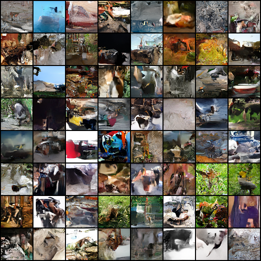
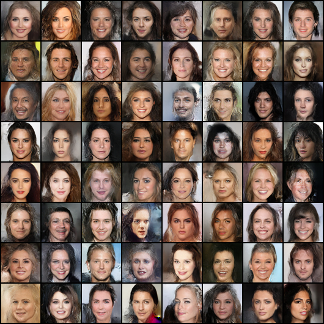

# glow-pytorch

Implementation of "Generative Flow with Invertible 1x1 Convolutions" (https://arxiv.org/abs/1807.03039) in Pytorch

For personal study and research, I referred to several Normalizing-Flow repositories and refactored the code to facilitate normalizing flow-related experiments. 

# Requirements

- PyTorch 1.7.1
- CUDA 11.0

> git clone https://github.com/dajinstory/glow-pytorch.git  
> cd glow-pytorch  
> pip install requirements.txt  

# Usage

## Preparing Dataset, Configs

For training, you need to prepare Dataset and meta file. Meta file for ImageNet and Celeba dataset are in data/{DATASET_NAME}/train_meta.csv. It only contains the file name of dataset.

Also you should edit config files. There are "*_path" named keys. Those keys contains root path of dataset, path of meta file and path to save log and checkpoint files.

## Training Model

You can train model from scratch,
> bash script/train/train_glow_64x64_celeba.sh  

resume from pretrained checkpoints,
> bash script/resume/train_glow_64x64_celeba.sh  

and finetune from pretrained weights
> bash script/finetune/train_glow_64x64_celeba.sh  

## Demo

You can check the sampling result of the pretrained model by running src/demo.ipynb

If you want to utilize the GLOW model for your personal research, you just need to refer to src/demo.ipynb, src/model/ and src/loss/nll_loss.py.

## Pretrained Checkpoints

I trained 64x64 model on ImageNet and 256x256 model on Celeba dataset for ???? and ???? iterations, respectively. These models followed the setting from GLOW official paper. I got bpd(bits per dimension) about ?? and ?? for each, which are ?? and ?? from official paper. Maybe data preprocessing, training loop could made this difference. I trained 64x64 model with 1 GPU, 64 batch size on each GPU. And I trained 256x256 model with 4 GPUs, 8 batch size on each GPU. 

Also I trained 64x64 model on Celeba 64x64 Dataset and trained 256x256 model which has affine-coupling rather than additive-coupling used in official paper. I got bpd(bits per dimension) about ?? and ?? for each.

|      HParam       |          GLOW64x64V0          |         GLOW256x256V0         |         GLOW256x256V1         |
| ----------------- | ----------------------------- | ----------------------------- | ----------------------------- |
| input shape       | (64,64,3)                     | (256,256,3)                   | (256,256,3)                   |
| L                 | 4                             | 6                             | 6                             |
| K                 | 48                            | 32                            | 32                            |
| hidden_channels   | 512                           | 512                           | 512                           |
| flow_permutation  | invertible 1x1 conv           | random permutation            | invertible 1x1 conv           |
| flow_coupling     | affine                        | additive                      | affine                        |
| batch_size        | 64 on each GPU, with 1 GPUs   | 8 on each GPU, with 4 GPUs    | 8 on each GPU, with 4 GPUs    |
| y_condition       | false                         | false                         | false                         |

|     Model     |   Dataset   |                              Checkpoint                                     |          Note         |
| ------------- | ----------- | --------------------------------------------------------------------------- | --------------------- |
| GLOW64x64V0   | ImageNet    | [GLOW64X64V0_ImageNet](TBD)  | Official Setting      |
| GLOW64x64V0   | CelebA      | [GLOW64X64V0_CelebA](TBD)  | 64x64 CelebA Dataset   |
| GLOW256x256V0 | CelebA      | [GLOW256X256V0](TBD)  | Official Setting      |
| GLOW256x256V1 | CelebA      | [GLOW256x256V1](TBD)  | additive -> affine    |

# Samples

Sample from 64x64 ImageNet dataset. At ???,??? iterations. (trained on ?.??M images)

Sample from 64x64 Celeba dataset. At ???,??? iterations. (trained on ?.??M images)

Sample from 256x256 Celeba dataset, GLOW256x256V0. At ???,??? iterations. (trained on ?.??M images)

Sample from 256x256 Celeba dataset, GLOW256x256V1. At ???,??? iterations. (trained on ?.??M images)

# Reference
https://github.com/VLL-HD/FrEIA  
https://github.com/rosinality/glow-pytorch  
https://github.com/y0ast/Glow-PyTorch  
https://github.com/chaiyujin/glow-pytorch  

@inproceedings{kingma2018glow,
  title={Glow: Generative flow with invertible 1x1 convolutions},
  author={Kingma, Durk P and Dhariwal, Prafulla},
  booktitle={Advances in Neural Information Processing Systems},
  pages={10215--10224},
  year={2018}
}

@inproceedings{nalisnick2018do,
    title={Do Deep Generative Models Know What They Don't Know? },
    author={Eric Nalisnick and Akihiro Matsukawa and Yee Whye Teh and Dilan Gorur and Balaji Lakshminarayanan},
    booktitle={International Conference on Learning Representations},
    year={2019},
    url={https://openreview.net/forum?id=H1xwNhCcYm},
}

@software{freia,
  author = {Ardizzone, Lynton and Bungert, Till and Draxler, Felix and Köthe, Ullrich and Kruse, Jakob and Schmier, Robert and Sorrenson, Peter},
  title = {{Framework for Easily Invertible Architectures (FrEIA)}},
  year = {2018-2022},
  url = {https://github.com/VLL-HD/FrEIA}
}

